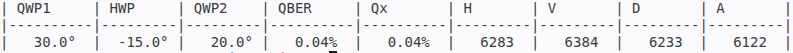

Rotating Waveplates
===================

This example simulates how rotating waveplates affects the measured
polarisation correlations of an entangled photon pair.

A maximally entangled state is measured using two simulated BB84 measurement
stages. A fixed polarisation transformation is applied to one photon, followed
by a set of three waveplates consisting of a quarter-waveplate, half-waveplate,
and second quarter-waveplate.

The waveplate angles are gradually changed over the course of the simulation.
At each position, the resulting quantum state and joint BB84 measurement
probabilities are calculated. These probabilities are used to update a live
timetag simulation, producing stochastic detector events with configurable
singles rates, coincidence delay, and timing jitter.

The simulated timetags are processed to obtain singles and coincidence counts
over successive acquisition intervals. Coincidences in the Z and X measurement
bases are then used to calculate the corresponding error rates.

This example demonstrates how changes to optical components can be propagated
from a quantum-state model through to simulated timetag measurements and QKD
metrics.

.. literalinclude:: ../../../examples/qber_waveplate_rotation.py
   :language: python
   :linenos:
   :caption: examples/qber_waveplate_rotation.py