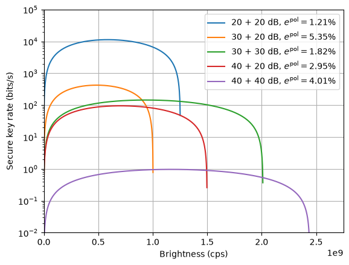

Secure key rate and source brightness
=====================================

This example models the secure key rate of a continuous-wave entanglement-based
QKD system as a function of the source brightness.

Several links with different losses, polarisation errors, coincidence windows,
and timing characteristics are simulated. For each link, the singles,
coincidences, accidental coincidences, QBER, and secure key rate are calculated
over a range of source brightnesses.

The resulting plot illustrates the trade-off between increasing the photon=pair
generation rate and the increase in accidental coincidences at high brightness.

.. literalinclude:: ../../../examples/skr_brightness.py
   :language: python
   :linenos:
