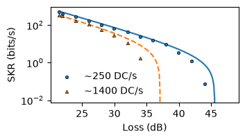

Secure key rate and channel loss
================================

This example calculates the secure key rate of an entanglement-based QKD system
as the channel loss is varied.

The model includes detector dark counts, detector dead time, timing
imprecision, accidental coincidences, and the bit and phase error rates. It
uses detector-resolved coincidence rates to calculate the expected secure key
rate.

Experimental coincidence data are also read from CSV files. qtoolkit is used
to calculate the QBER, phase-basis error rate, and secure key rate from the
measured coincidence counts, allowing the measured data and model to be
displayed together.

.. literalinclude:: ../../../examples/skr_loss.py
   :language: python
   :linenos:
