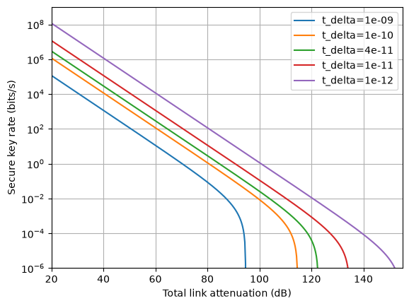

Effect of timing imprecision and channel loss
=============================================

This example investigates how detector timing imprecision affects the secure
key rate as the total link attenuation increases.

For each value of the total attenuation, the source brightness and coincidence
window are varied numerically to find the combination that maximises the secure
key rate. This optimisation is repeated for several timing imprecisions.

The resulting curves show how improved timing resolution allows useful key
rates to be maintained at greater channel losses.

.. literalinclude:: ../../../examples/skr_loss_timing.py
   :language: python
   :linenos: